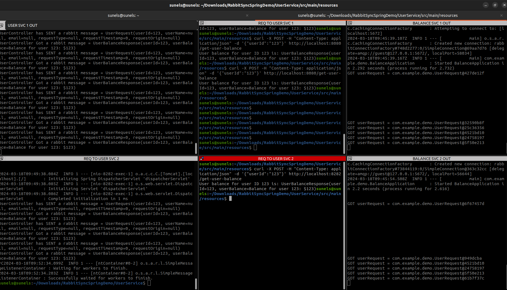

# User_Service is communicating with Balance_Service using RabbitMQ 
  - Microservice communication via message brokers
  - Scale Service independently
  - DynamicQueueNames RabbitMQ + Spring
  - RabbitMQ replyTo

# START RABBIT :
    cd UserService/src/main/resources
    docker-compose up -d

# START USER SERVICE APP USING DOCKER :
    If you have changes, you may mvnw clean then package or using using intellij maven plugin!
    docker build -t urs .
    docker run --network host -e PORT=8080  urs
    docker run --network host -e PORT=8282  urs 

# START BALANCE SERVICE APP USING DOCKER :
    docker build -t brs .
    docker run --network host -e PORT=8181  brs
    docker run --network host -e PORT=8383  brs

# SEND HTTP REQUEST
    curl -X POST -H "Content-Type: application/json" -d '{"userId":"123"}' http://localhost:8080/get-user-balance
    curl -X POST -H "Content-Type: application/json" -d '{"userId":"123"}' http://localhost:8282/get-user-balance

